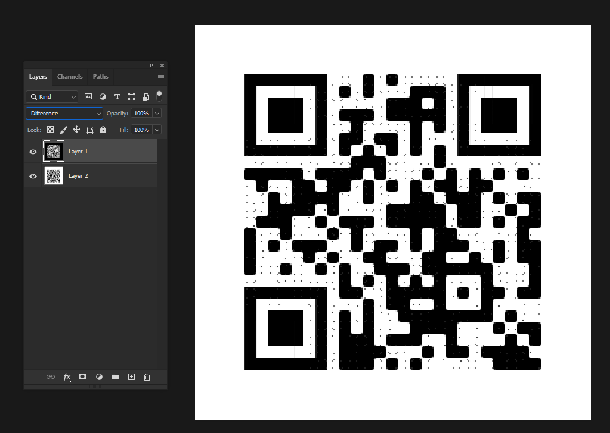
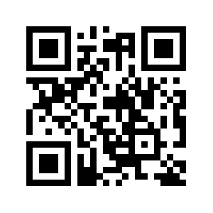

# CM01
> 250pts

## Briefing
> Download the file and find a way to get the flag.

## Solution
The provided file can be found [here](cm01.zip).

Scanning the first QR code, `frame.png`, gives us the output `Hey, I've put the flag into the other file using the same trick we always use.  You know what to do. :)`.

This means we need to focus on the QR code `code.png`.

Opening the image in Adobe Photoshop and subtract the black one from the white one - also known as changing your layer type to `Difference`:

Now this is good enough to get the flag, however if you happen to have no life you can do a touch of post-processing. For all you nerds, this is done by leveling out a lot of noise followed by scaling it down then back up using nearest neighbour:

The QR code now outputs `FLAG: A_Code_For_A_Code`.

## Flag
Flag: `A_Code_For_A_Code`
